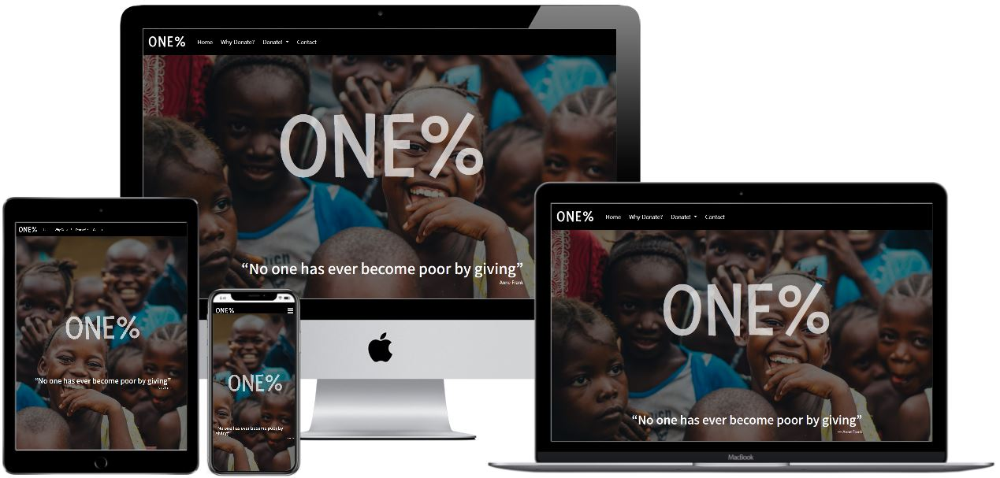
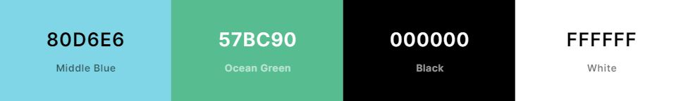

<h1 align="center">Milestone Project 1 - ONE%</h1>

[Click here to view the live project :link:](https://matsim91.github.io/Milestone-Project-1-One-Porcent)

ONE% is a charity project. The first main purpose is to make people aware that everyone can donate a really small portion of their income and this would still make a great difference in the lives of many children and adults in poor condition. The second main purpose is to re-direct potential donors to three non-profit organizations where they can donate directly to these organizations.

# Table Of Contents

1. [User Experience (UX)](#user-experience)
    - [User stories](#user-stories)
    - [Design](#design)
    - [Wireframes](#wireframes)
2. [Features](#features)
3. [Technologies Used](#technologies-used)
4.  [Languages Used](#languages-used)
5.  [Frameworks, Libraries & Programs Used](#frameworks-libraries-and-programs-used)
6.  [Testing](#testing)
    - [Testing User Stories](#testing-user-stories)
7. [Deployment](#deployment)
8. [Credits](#credits)
    - [Code](#code)
    - [Content](#content)
    - [Media](#media)
    - [Acknowledgements](#acknowledgements)

# User Experience

The website ONE% was created with the main intent to inspire everyone to donate to charity organizations. All the content was chosen to show happiness and gratefulness. It was focused on the happy results that a donation can bring to poor kids. The website content shows that no matter how much you donate, this would still make a huge difference. It also covers the benefits of the donations, why Users should donate, and explain and suggest a donation to three different charity organizations as well as a direct link to the donation page of each organization.

We want to make Users feel grateful for the simple things they have, and to feel the potential impact of their donation.

-   ## User stories

    -   ### First Time Visitor Goals
        1. As a First Time user, I want to quickly understand the main objective of the website and what it offers.
        2. As a First Time user, I want to navigate naturally and easily through the website different pages (using the navbar to go to a specific page or using the arrow on the bottom of the page to navigate the entire website in a continuous flow).
        3. As a First Time user, I want to get interested in charity and look for further information within the website.
        4. As a First Time user, I want to understand the powerful outcomes that a simple and small donation can bring to poor kids.
        5. As a First Time user, I want to make my first donation to one of the three charity organizations.

    -   ### Returning Visitor Goals
        1. As a Returning user, I want to get in touch with ONE% for more information.
        2. As a Returning user, I want to be motivated to make a new donation to a new institution.
        3. As a Returning user, I want to be familiarized with the website and use the navbar to go to the specific page I am looking for.

    -   ### Frequent User Goals
        1. As a Frequent user, I want to navigate the website looking for new updates regarding the different non-profit organizations working in Africa.
        2. As a Frequent user, I want to be motivated to keep donating and maybe donate to a charity organization that I didn't donate yet.
        3. As a Frequent user, I want to check on new content and new donation pages for a new charity organization.

-   ## Design
    -   ### Colour Scheme
	    - I have used [Coolors](https://coolors.co/80d6e6-57bc90-000000-ffffff) to choose the color pallete.

        - The four main colors used are Middle Blue (#80D6E6), Ocean Green (#57BC90), Black (#000000) and White (#FFFFFF).

        - I choose the colors that are more alive and better represent happiness and childhood for the body. For the navbar and footer I choose a more neutral color for balance and to not take the focus of the main content which is the body of the website.

        

    -   ### Typography
	    - For the logo, I choose the "Fresca" font to give a very happy looking and better show the purpose of the website.

        - For the quoting phrase on the hero image I choose the "Noto Sans KR" font, a bit lighter than the logo but not so light in order to not be difficult to read and not disappear on the hero image.

        - For the H2 headers I choose the "Livvic" font to give a good highlight and still maintaining a happy atmosphere.

        - For the content beneath the H2 headings I have used a more default font: "Segoe UI" to focus on readability.

        - All fonts were imported from [Google Fonts](https://fonts.google.com/).

    -   ### Imagery
        - All the images on the site were chosen to show happiness. I focused more on what the outcomes of charity and donation can bring to the kids instead of showing their poor and sad condition. Hopefully, by showing the outcome I can motivate people to donate and understanding the power and the beautiful results that a small donation can bring.

	    - The hero image was carefully chosen to give life to the website and really stand out on the homepage. It was intended to show the happiness and hope that these kids have even when living in poor conditions. Happiness is simple, happiness is being grateful for what we have, this is the intent of the images spread across this website and also the intent of the content.

        - The remaining images were chosen due to the vivid contrast they bring and to also show gratitude and happiness.

        - To avoid images being too heavy to load I have compressed all images using [TinyPNG](https://tinypng.com/) which also compresses JPEG images.

        - Images were taken from [Unsplash](https://unsplash.com/) and [pixabay](https://pixabay.com).

*   ## Wireframes

    - The wireframe was developed using [balsamiq](https://balsamiq.com/).

    - Home Page Wireframe - [View](https://github.com/MatSim91/Milestone-Project-1-One-Porcent/blob/master/project/wireframes/home.JPG)

    - Why Donate? Page Wireframe - [View](https://github.com/MatSim91/Milestone-Project-1-One-Porcent/blob/master/project/wireframes/why-donate.JPG)

    - Donate! Page Wireframe - [View](https://github.com/MatSim91/Milestone-Project-1-One-Porcent/blob/master/project/wireframes/donate.JPG)

    - Contact Page Wireframe - [View](https://github.com/MatSim91/Milestone-Project-1-One-Porcent/blob/master/project/wireframes/contact.JPG)

# Features

- [Burger navbar](https://mdbootstrap.com/snippets/jquery/pedrovtesanchez/378890) - Condense the menu when the viewport size is smaller than 575px.

- [Drop down menu](https://getbootstrap.com/docs/4.0/components/dropdowns/) - Using bootstrap library and Popper.js library.

- [Bootstrap Grid](https://getbootstrap.com/docs/4.5/layout/grid/) - Responsive on all device sizes

- [Deck cards structure](https://getbootstrap.com/docs/4.0/examples/pricing/) - Imported from Bootstrap and customized. Used on the Home page.

- [Hover.css](https://ianlunn.github.io/Hover/) - For interactive effects used the Border Transitions: Outline Out effect on the Home page deck cards.

- [Flip cards](https://www.w3schools.com/howto/tryit.asp?filename=tryhow_css_flip_card) - Used on the Why Donate page.

- [Contact form structure](https://getbootstrap.com/docs/4.0/components/forms/) - Imported from Bootstrap site and customized.

# Technologies Used

A brief overview of the languages, frameworks, and other tools I've used on this project:

- [HTML5](https://en.wikipedia.org/wiki/HTML5)
    - Semantic markup language as the shell of the site.

- [CSS3](https://en.wikipedia.org/wiki/Cascading_Style_Sheets)
    - Cascading Style Sheets as the design of the site.

- [Bootstrap Grid](https://getbootstrap.com/docs/4.0/layout/grid/)
    - Grid allows for a responsive layout across various platforms.

- [JavaScript](https://www.javascript.com)
   - Used for open/close effect on mobile navbar and for open/close effect of the dropdown menu.

- [Font Awesome 5](https://fontawesome.com)
   - Used for the Donation Benefits, Deck Cards, Next Page Arrow and in the social media icons on the footer.

# Languages Used

-   [HTML5](https://en.wikipedia.org/wiki/HTML5)
-   [CSS3](https://en.wikipedia.org/wiki/Cascading_Style_Sheets)

# Frameworks Libraries and Programs Used

1. [Bootstrap 4.5.3:](https://getbootstrap.com/docs/4.5/getting-started/introduction/)
    - Bootstrap was used to assist with the responsiveness and styling of the website.
2. [Hover.css:](https://ianlunn.github.io/Hover/)
    - Hover.css was used on the interactive effects used theBorder Transitions: Outline Out effect on the Home page cards.
3. [Google Fonts:](https://fonts.google.com/)
    - Google fonts was used to import the Livvic, Fresca and Noto San KR fonts into the style.css file which is used on all pages throughout the project.
4. [Font Awesome:](https://fontawesome.com/)
    - Font Awesome was used on all pages throughout the website to add icons for aesthetic and UX purposes.
5. [jQuery:](https://jquery.com/)
    - jQuery came with Bootstrap to make the navbar responsive.
6. [Git](https://git-scm.com/)
    - Git was used for version control by utilizing the Gitpod terminal to commit to Git and Push to GitHub.
7. [GitHub:](https://github.com/)
    - GitHub was used to store the projects code after being pushed from Git.
8. [Balsamiq:](https://balsamiq.com/)
    - Balsamiq was used to create the [Wireframes](#wireframes) during the design process.
9. [Popper.js:](https://popper.js.org/)
    - Popper was used to create the Dropdown menu in the navbar.
10. [Google Chrome DevTools](https://developers.google.com/web/tools/chrome-devtools)
    - Used for testing and fixing website bugs.

# Testing

- All the links were tested thoroughly (navbar, footer, next page arrows, donation redirects, and contact form).

- Contact form was tested while trying to submit without filling the required fields (Name, Email, and Subject) and I have used the Code Institute formdump.

- The website was tested in Google Chrome, Microsoft Edge, Mozilla Firefox, both on Windows and Mac OS.

- Through the Console device toolbar it was also tested using the following emulated devices: Moto G4, Galaxy S5, Pixel 2, iPhone 5/SE iPhone 6/7/8, iPhone X, iPad, iPad Pro, Surface Duo.

- Used [Am I Responsive](http://ami.responsivedesign.is/#) for testing different viewports and a [Mockup Generator](http://techsini.com/multi-mockup/index.php) to create the image being used on the top of this readme.

- The W3C Markup Validator and W3C CSS Validator Services were used to validate every page of the project to ensure there were no syntax errors in the project:

    -   [W3C Markup Validator](https://jigsaw.w3.org/css-validator/#validate_by_input) - [Results](https://validator.w3.org/nu/?doc=https%3A%2F%2Fmatsim91.github.io%2FMilestone-Project-1-One-Porcent%2F) - I have validated using Direct Input from each HTML page and by URL.

    -   [W3C CSS Validator](https://jigsaw.w3.org/css-validator/#validate_by_input) - [Results](https://jigsaw.w3.org/css-validator/validator?uri=https%3A%2F%2Fmatsim91.github.io%2FMilestone-Project-1-One-Porcent%2F&profile=css3svg&usermedium=all&warning=1&vextwarning=&lang=en) - I have validated CSS using Direct Input and by URL. OBS: There is 10 warning due to some -webkits added on CSS, they were imported from external libraries and are needed to add interactivity.

## Testing User Stories

-   ### First Time Visitor Goals
    1. On the index page Users can understand the main objective of the website and what if offers by reading the "Why ONE%?" Section.
    2. I navigated through the entire website pages using the Navbar and the Next Page arrows to confirm all the href links were correct and working.
    3. I have used interactivity on the Index and Why Donate page to keep the website interesting for the user and also added information about the different charity organizations we can redirect the user to under the Donate page. I have tested the interactivity by hovering the mouse on the desktop and touching on it through a mobile.
    4. On the Donation Benefits and on the Why donate page users can understand the difference that a simple donation can bring.
    5. On the Donate page we offer a quick re-direct to the official charity organization directly to the donation page of their website. I have tested the href links re-directing the user to the donation page of each one of the three charity organizations.

-   ### Returning Visitor Goals
    1. Returning Users can use the contact form to send us an email. I have tested the submit by posting data to Code Institute form dump. I have also tested the required option on the contact form fields to make sure users are inserting their name, email, and subject.
    2. Keep returning Users motivated by updating new content on the Home, Why Donate, and Donate page.
    3. Returning Users that already have a focus in mind while accessing the webiste can use the top navigation bar to go straight to the page they want.

-   ### Frequent User Goals
    1. Using the top navbar the Frequent Users can go directly to the Donate page to check on new updates of the non-profity organizations working in Africa.
    2. We want to motivate Frequent Users to keep donating and to check on a new organization he didn't donate to yet by checking the Donate page and the organizations description.
    3. To keep a Frequent User interested in the website we want to have the website always updated with new content and with new organizations on the Donate page.

# Deployment

- For this project, I have used the cloud-based IDE [Gitpod](https://gitpod.io/) and [GitHub](http://github.com/) as a free git repository hosting.

    1. I started the project by creating a new Repository on GitHub and loading the [Code Institute Gitpod Template](https://github.com/Code-Institute-Org/gitpod-full-template).

    2. Installed the [Gitpod extension](https://chrome.google.com/webstore/detail/gitpod-dev-environments-i/dodmmooeoklaejobgleioelladacbeki) and on my GitHub repo I clicked on the Gitpod button to create a new Master Workspace on GitPod.

    3. After creating the workspace I developed the website using Gitpod and pushing my commits to GitHub using the following commands:
        - `git add "file-name"` - To add a file for staging.
        - `git commit -m "description-of-update"` - To commit.
        - `git push` - To push my commits to GitHub
        - I have also used extra git commands such as: 
        - `python3 -m http.server` - To run a preview of the website on the browser.
        - `git status` - To display the current state of the working directory and the staging area.

## Running locally

1. Go tho this [project repository](https://github.com/MatSim91/Milestone-Project-1-One-Porcent) in GitHub while signed in in your own GitHub account.
2. Click on the dropdown menu Code option.
3. Click on "Open with GitHub Desktop" to clone and open the repository locally.
4. Click on the "Choose" option and navigate to the local path where you want the cloned repository to be.
5. Click "Clone"

- [Click here](https://docs.github.com/en/free-pro-team@latest/desktop/contributing-and-collaborating-using-github-desktop/adding-and-cloning-repositories) for more cloning GitHub options.

# Credits

- Thanks to Ian Lunn for the [Hover.css](https://ianlunn.github.io/Hover/) effects.

- Thanks to the [Code Institute Course](https://codeinstitute.net/) for the great idea of the large hero image and opaque overlay that I have learned through the "Customizing Our Landing Page" on the "Bootstrapping Your Next Big Idea With Bootstrap" module.

- Thanks to Bootstrap for the [Deck cards structure](https://getbootstrap.com/docs/4.0/examples/pricing/).

- Thanks to Bootstrap for the [Drop-down Menu](https://getbootstrap.com/docs/4.0/components/dropdowns/).

- Thanks to bootstrap for the [Contact form structure](https://getbootstrap.com/docs/4.0/components/forms/).

- Thanks to W3 Schools for the [Interactive Flip cards](https://www.w3schools.com/howto/tryit.asp?filename=tryhow_css_flip_card).

- Thanks to MDB Bootstrap and Pedro Sanchez for the [Burger navbar](https://mdbootstrap.com/snippets/jquery/pedrovtesanchez/378890).

- Thanks to [Font Awesome](https://fontawesome.com/) for the free icons.

- Thanks to [The Water Project](https://thewaterproject.org/), [Fraternity Without Borders](https://www.fraternitywithoutborders.co.uk/) and [Save the Children](https://www.savethechildren.org/)
 for giving the opportunity to redirect potential donations to their websites and for the website description used on the Donate page.

- Thanks to [Unsplash](https://unsplash.com/) and [pixabay](https://pixabay.com) for providing for free lots of great pictures.

## Code

-   [Bootstrap4](https://getbootstrap.com/docs/4.5/getting-started/introduction/) - Bootstrap Library used throughout the project mainly to make site responsive using the Bootstrap Grid System.

- [Contact form structure](https://getbootstrap.com/docs/4.0/components/forms/), [Drop-down Menu](https://getbootstrap.com/docs/4.0/components/dropdowns/), and [Deck cards structure](https://getbootstrap.com/docs/4.0/examples/pricing/) - From bootstrap documentation.

- [Burger navbar](https://mdbootstrap.com/snippets/jquery/pedrovtesanchez/378890) - From MDB Bootstrap website.

- [Interactive Flip cards](https://www.w3schools.com/howto/tryit.asp?filename=tryhow_css_flip_card) - From W3 Schools.

- [Hero Image Code](https://codeinstitute.net/) - From Code Institute "Customizing Our Landing Page".

- [Hover.css effects](https://ianlunn.github.io/Hover/) - From Ian Lunn GitHub.

## Content

- The quoted phrase on the hero image is from Anne Frank.

- The description of the charity organizations (The Water Project, Fraternity Without Borders and Save the Children) on the Donate section was taken from their respective websites.

- All the remaining content on the website was written by me.

## Media

-   Images were taken from free images source websites [Unsplash](https://unsplash.com/) and [pixabay](https://pixabay.com)

## Acknowledgements

-   My mentor Akshat for all his help and ideas.

-   Slack channel peer-code-review for feedback.

-   Code Institute Tutor Assistance for helping solving overflow on the Why Donate page.